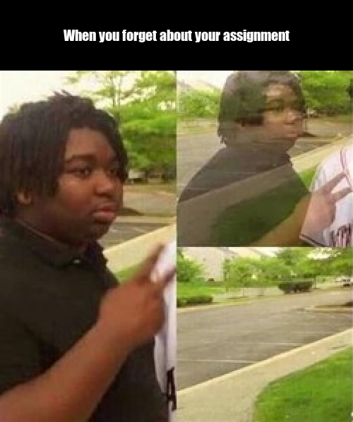

<h1> My Meme </h1>




```{r}
library(magick)

meme <- image_read("https://www.memesmonkey.com/images/memesmonkey/s_19/19fef3942728b3581678adcfb33a15a6.jpeg") %>%
  image_scale(500)

meme_text <- image_blank(width = 500,
                         height = 100,
                         color = "#000000") %>%
  image_annotate(text = "When you forget about your assignment",
                 color = "#FFFFFF",
                 size = 20,
                 font = "Impact",
                 gravity = "center")

meme_1 <- c(meme_text, meme) %>% 
  image_append(stack = TRUE)

image_write(meme_1, "my_meme.png")

```

<h2> Comments </h2>

<ul>
  <li>I believe this is an experience <b>every</b> student can understand and thus relate to.</li>
  <li>I personally like this meme and have thus <i>incorporated</i> it into this assignment.</li>
</ul>


